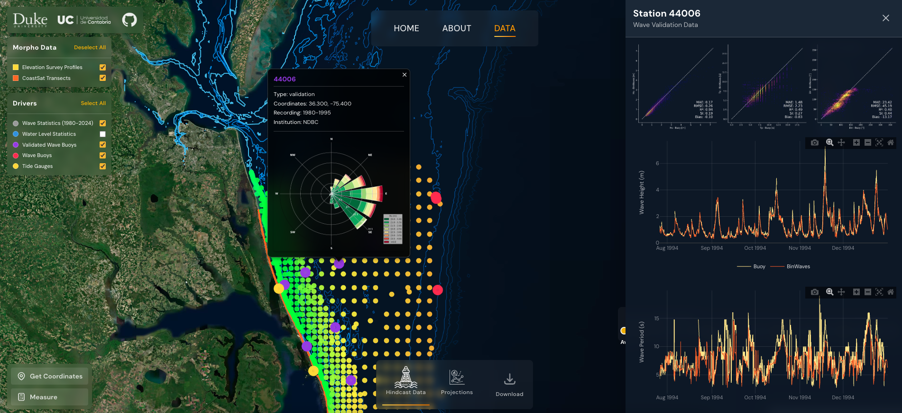
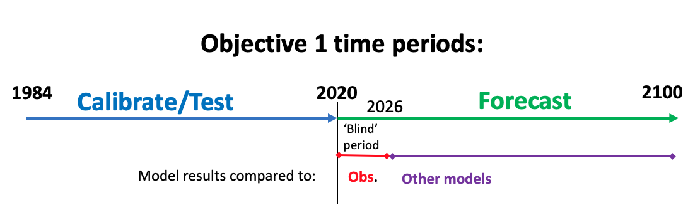
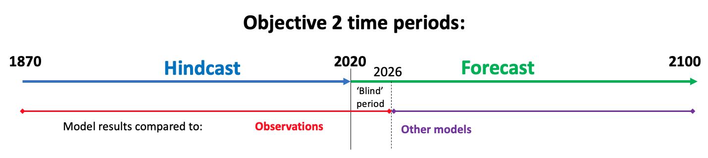

# ShoreShop 3.0: Workshop and Model-Intercomparison Project

The workshop and Model-Intercomparison Project (MIP) will address the processes causing shoreline and coastline change over a range of time and space scales, and examining how those processes interact in interesting ways. 
This repository contains basic Jupyter Notebooks to use the datasets provided for ShoreShop 3.0. However, due to the data-intensive nature of this ShoreShop, the data must be downloaded through the webpage https://shoreshop3.netlify.app/data. 

## Background and Objectives

ShoreShop 3 shifts the focus from that of previous editions to a contrasting coastal setting—the extended barrier coast of North Carolina, USA. This workshop and project will build on two previous related MIPs (Montaño et al., 2020; Mao et al., 2025), further exploring processes and associated scales by comparing model results to each other and to observations.

This edition also broadens the scope, exploring a wider range of spatial and temporal scales — from daily to decadal shoreline change local to Duck, NC and the surrounding Northern Outer Banks, to longer-term change along the whole North Carolina coast.

For the first objective (https://shoreshop3.netlify.app/about; ‘Data Rich’ under Key Domains and Research Questions), which addresses daily-to-decadal time scales in a relatively data-rich context, the region of interest is the Northern Outer Banks, NC, with special focus on the beach at Duck for those who want to address one location. For the 1 km section of beach in the vicinity of the Field Research Facility we provide waves and water levels every 500 m at 10 m water depth for the years 1980–2023, shoreline positions along multiple transects for the same time period, average bathymetry profiles for those transects, and recent gridded bathymetry. For the rest of the Northern Outer Banks (~ VA border to Cape Hatteras), we provide waves and water levels along the full coastline at 500 m resolution (10 m water depth), as well as an additional offshore grid with 3 km resolution for the entire coast. For shoreline evolution at this scale, we will use satellite-derived shorelines (CoastSat) every 50 m.

The second objective (https://shoreshop3.netlify.app/about; ‘Sparse Data’ under Key Domains and Research Questions) is addressing annual to century timescales and larger spatial scales. For this, a second part of the dataset will be released in March, including longer-term (century-scale) hindcasts and shoreline data derived from historical sources aimed at analyzing long-term coastal evolution on scales up to the whole NC coast. Additional datasets related to future wave projections under climate change scenarios, tropical cyclone projections, and more will also be included. More information about model submission requirements will be provided closer to the submission date.

## Notebooks
The following notebooks are available in this repo:

1. Wave&Winds_Hindcast_1980_2023.ipynb
2. Water_Levels_1980_2023.ipynb
3. Shorelines&BeachProfiles.ipynb

### IMPORTANT:
To run these notebooks, you must first download the data files and save them to certain paths. See the individual notebooks for further instructions.

## Tasks

Two main tasks will be attempted in this ShoreShop. Participants can decide which task(s) they want to address.

### Objective 1. Data Rich, High Resolution Context: 
- Task 1.1. (Mandatory) Predict the shoreline position at Duck Beach (Profile 1 and Profile 1006) between 1980-01-01 and 2023-12-31 with daily timestep, for the 2 profiles provided. 
- Task 1.2. (Optional) Predict the shoreline position at Northern Outer Banks (Hatteras - Virginia) between 2020-01-01 and 2023-12-31 with daily timestep, using Satellite Derived Shorelines (SDS).
- Potential tasks: Shoreline change of a subset of the Northern OBX.
Evaluation:  Distribution of the variance. Spatial patterns of the distributions using wavelets analysis

### Objective 2. Sparse Data, Large Scale, Long-Term Change.
- Task 2.1. (Optional) Century Hindcast & Forecast. Predict the shoreline position at Duck Beach between 1870 to present for the 2 Profiles provided. 
- Task 2.2. (Optional) Century Hindcast & Forecast. Entire North Carolina.
- Optional task: Subset change of a subset of the Northern OBX.

### Modeling rules
- Participants should not attempt to retrieve extra shoreline information beyond the provided years
- Participants may use any type of model, including but not limited to hybrid and data-driven models.
- Participants must complete at least one task, although attempting both is encouraged.
- Participants must provide a brief description of the methodology used.
- Code submission is optional.
- Each participant can have multiple submissions.

## Metrics for comparing model results to observations (and model results to each other)

The main comparison approach, which will allow us to evaluate how much of the variance different models/process sets can explain at different timescales, will involve **wavelet analyses of shoreline-change time series**. 

For profile-specific modeling, we will:

-	Compare wavelet diagrams (plotting variance vs timescale on y axis and time on the x axis) using cross-wavelet coherence (e.g. Ruessink et al., 2006).
-	In addition, average the variance at each timescale over the time series, to produce wavelet power spectra. 
-	Then, compare observations and model results by calculating the correlation and RMSE between variance at each timescale for power spectra
-	(As a secondary, deterministic approach, we will also calculate and compare Taylor Diagrams)

For spatially extended modeling, we will:

-	produce wavelet diagrams and power spectra for each alongshore location (500 m spacing)
-	compare observations and model results for each alongshore location using the approaches above
  
-	In addition, to produce summary statistics, calculate:
  - The **correlation and** **RMSE between the variance at each alongshore location, for each timescale,** in model results and observations
  - The correlation and **RMSE between the variance at each alongshore location, summed over timescales** (resulting in a single lumped metric).
- (As a secondary approach, in addition to Taylor Diagrams, we will compare EOF/PCA analyses between observations and model results)

### Timescales
- For Objective 1 (Data-rich context, daily to decadal timescales, Northern Outer Banks and/or Duck profiles), the calibration/test period will be 1984-2020 (forcing data provided now), and we will evaluate models during the period 2020-2060.
  - The model evaluation period will consist to two sub periods
    - compare model results and observations (as described above) over the 'blind' period (honor system) of 2020 - 2026.
    - Compare model results with each other over the period 2026-2060.
  - The smallest timescale involved in the analyses will be limited by the return period of the observations (surveys for Duck, and CoastSat for spatially-extended): approximately two weeks.
  - We will evaluate the variance at the following timescales: 46 d, 92 d, 184 d, 1 yr, 2 yr, 4 yr, 8 yr, and 16 yr
  - We plan to add timescales down to approximately 2 days, pending access to a daily shoreline data set

- For Objective 2 (Sparce Data, annual to century timescales, all of NC and/or Duck profiles; forcing data will be available in March),
  - Hindcasts will extend back to 1870 (comparing models to observations)
  - Forecasts will extend to 2100 (comparing models to each other)
  - We will evaluate variance at the following timescales (in years): 1, 2, 4, 8, 16, 32, and 64.

